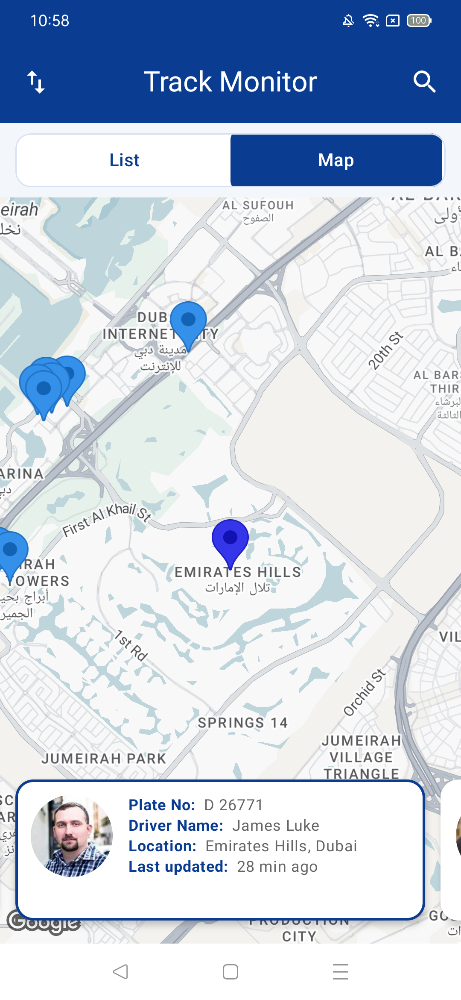
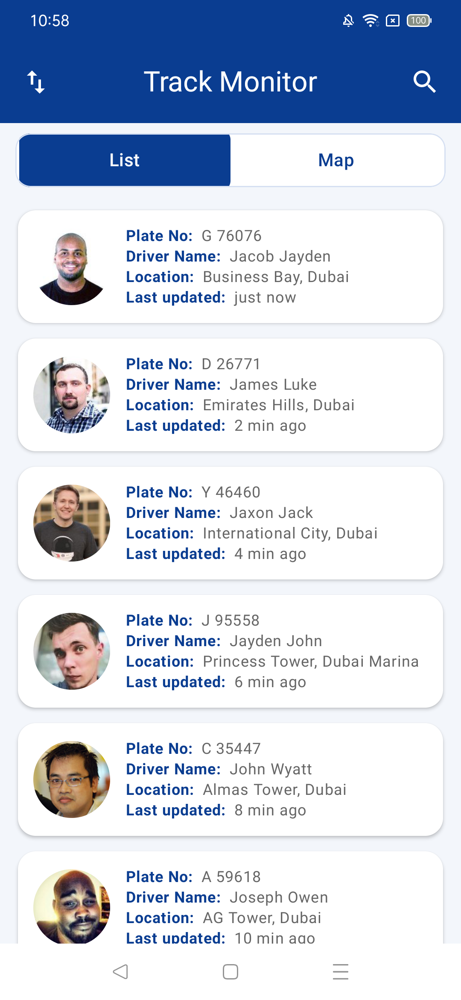

# Track Monitor App Assignment

This repository contains my solution for the **Track Monitor App** assignment. The app is developed in **Android (Kotlin/Jetpack Compose)** following clean architecture principles.

---

##  Features

- **Single Screen UI** with:
  - **List view** for displaying data
  - **Map view** showing locations
- **Data retrieval** from the provided API
- **Search functionality** to filter results
- **Sorting** by `lastUpdated` field
- **Clean architecture** implementation
- **Unit & integration tests** ensuring minimum **60% code coverage**
- Design references are included in the attached files

---

##  Screenshots

  

---

##  Demo Video

---

##  Technical Details

- **Language & Framework**: Kotlin, Jetpack Compose  
- **Architecture**: Clean Architecture (MVVM / MVI)  
- **Testing**: - Clean architecture implemented to ensure testable components All testable components are capable of achieving minimum 60% code coverage
- **API**: Data fetched from the provided endpoint  
- **Sorting & Search**: Implemented on `lastUpdated` field

---

